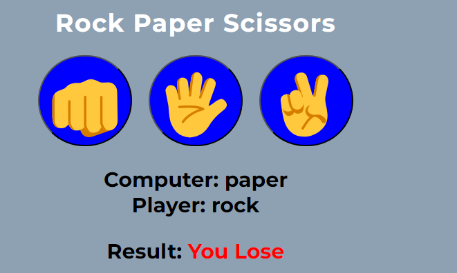
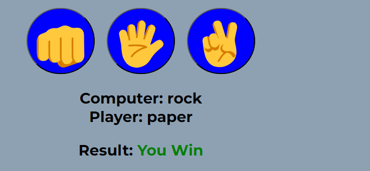
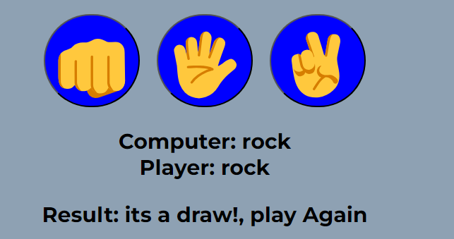
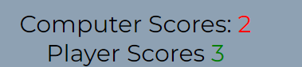
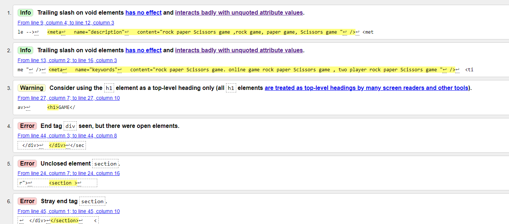
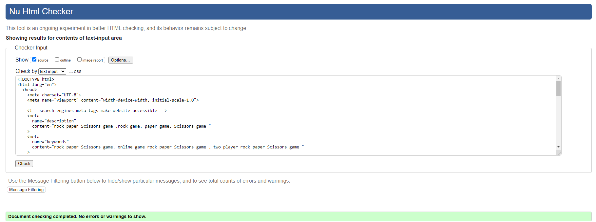
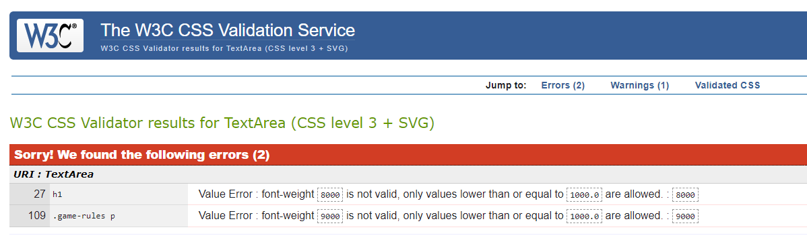
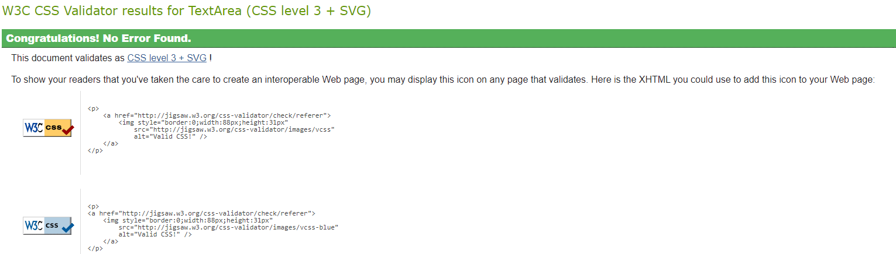
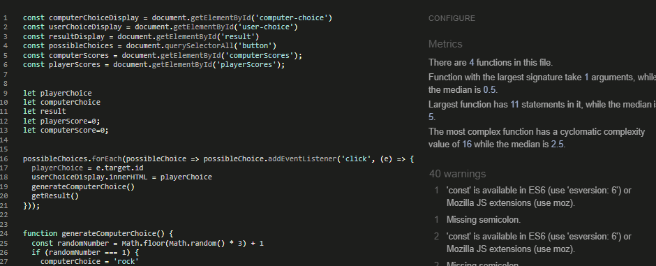
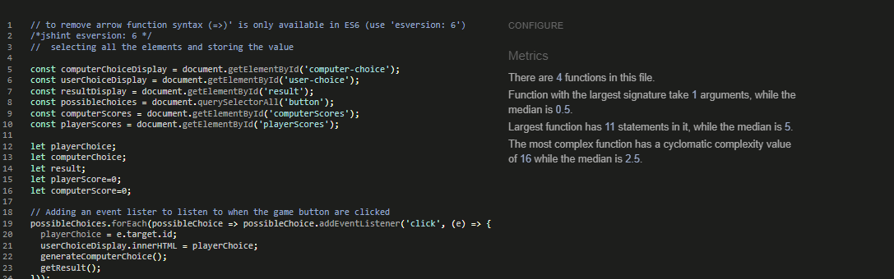

# Rock-Paper-Sciscors
[live project on Github](https://joelsita.github.io/project-two/)

## Project Description
Rock, Paper, Scissors. The familiar game of Rock, Paper, Scissors is played like this: at the same time, two players display one of three symbols: a rock, paper, or scissors. A rock beats scissors, scissors beat paper by cutting it, and paper beats rock by covering it.
- Website consist of two pages
  - Home page: this includes an explaination of the game and the rules on how to play.

  - Game page:there are four sections

      - Game choices section: there are 3 buttons to chose from(Rock, paper and scissors)
      - results section: this displays the result of each player choices. red message is for computer, black for tie and green is for user.

      - Score section: this keep record of the game. this is to let each player knows of their results as they play the game.

      - restart section: here the user can chose to restart the game from scratch instead of keep refreshing the page. This function wipes all the previous results and brings the game back to zero.

# Table of Contents
1. [UX](#user-experience-ux)
    - [User stories](#user-stories)
    - [New User](#new-user)
    - [Old User](#old-user)
2. [Design](#design) 
    - [Wireframes](#wireframes)
      - [Mobile](#mobile)
      - [Desktop](#desktop)
    - [ Colour Scheme](#colour-scheme)
    - [ Imagey](#imagery)
3. [Deployment](#deployment) 
4. [Features](#features)
   - [Video](#video)
   - [Welcome Message](#welcone-message)
   - [About US](#about-us-section)
   - [Galleries](#galleries-section)
   - [News & Events](#news-events)
    - [Contact US](#contact-us)
     - [Footer](#footer)

5. [Testing](#testing)
    - [Features Testing](#features-testing)
    - [Browser Testing](#browser-testing)
    - [Responsiveness](#responsiveness)
    - [Responsive testing](#responsive-testing)

6.   [Code Validation](#code-validation) 
      - [HTML Validation](#html-validation)
      - [CSS Validation](#html-validation) 

7.   [Lighthouse Test](#lighthouse-test) 
      - [Performance](#performance)

8.   [Libraries and Programs](#libraries-and-programs) 

9.   [Technologies Used](#technologies-used) 
      - [Languages](#languages)

10.   [Bugs & Solution](#bugs--solutions) 
      - [Solution](#solution)

11.   [Credits & Reference](#credits) 
      - [Code Used](#code-used)

12. [Media](#media)
12. [Acknowledgements](#acknowledgements)

# User experience (UX)
## User Stories

- As a user playing the game, I want the description of the game to be simple and clear to understand.
- I want a simple diagram which shows elements of the game.
- I want want the game buttons to be easy to use and navitage around.

- I want a message to display which options each player selected.

- I want to keep track of my score.
- I want to have the option to restart the game.
- I want to be able to return from home page easily so I can go back read the game rules and description.

## Design
Website is consist of one page. easy to navigate and smooth transition to go through each sections.
## Wireframes
#### Mobile
 

  #### Desktop
 

## Colour Scheme
 

## Imagery
- Images for this website was taken from mags foundation social media pages.

# Deployment
1. Select the project, and go to the Settings tab of your GitHub repository.
2. On the left-hand > under the Code and Automation section, select Pages.
3. under build and deployment >set 
Source to 'Deploy from Branch'.
The main branch is selected.
The folder is set to / (root).
4. Under Branch, click Save.
5. Go back to the Code tab. Wait a few minutes for the build to finish and refresh your repo.
6. On the right-hand side, in the Environments section, click on 'Github-pages'.

# Features
## Home Page
  
  - The home page to serve as a teaser and trustworthy guide towards the pages that have the necessary information. 
  - The home page displays the game Title and image which covers the element of the game.
  - A brief description of the game and rules on how to play.
  - There are 4 buttons on the home page
    - Home button: display in grey colour to show where you are located on the page. I have added an orange colour when the user hover-on the home button.
    - play game button: Displays in blue colour, when the user hovers on  the button it changes to orange. This button brings the user to the game page.

  - play now button: Displays in blue colour, when the user hovers over  button it changes to orange. This button brings the user to the game page.

## Game Page
  
  - Game title
 - There are 6 buttons on the Game page
   - Play-game button: display in grey colour to show where you are located on the page. I have added an orange colour when the user hover-on the home button.
   - home game button: Displays in blue colour, when the user hover-on  the button it changes to orange. This button brings the user to the home page. 
   - Three buttons of game choice used the hands emoji symbol which represents Rock Paper and Scissors.
   - restart button: instead of the user refreshing the page to start a new game this functionality gives the user the power to clear the results and start fresh.
- player and computer choice section:
  - computer choice shows first followed by the player's choice.
- Results section
  - if the computer wins the message is displayed in red colour
   
  - if the user wins the message is displayed in green colour
  
  - if the result is tied then the message is displayed in black colour.
   
- Game score section
  - when the computer wins the scoreboard is incremented by 1 and the colour is displayed in red. 
   - when the user wins the scoreboard is incremented by 1 and the colour is displayed in green. 
   
# Testing:
## Features Testing
All th feaures of the website have been tested to make sure it working as designed.

<table>
  <thead>
    <tr>
      <th>Feature</th>
      <th>Test case</th>
      <th>outcome</th>
    </tr>
  </thead>
  <tbody>
    <tr>
      <td>Navbar| Home</td>
      <td>click on home link</td>
      <td>This brings the user to home page</td>
    </tr>
    <tr>
      <td>Navbar| play game</td>
      <td>click on play game link</td>
      <td>This brings the user to game page/ pass</td>
    </tr>
    <tr>
      <td>button| play now</td>
       <td>click on play now button</td>
      <td>This redirect user to play the game/ pass</td>
    </tr>
    <tr>
       <td>button| game choices</td>
       <td>click on each button and the button clicked is being displayed</td>
      <td>/ pass</td>
    </tr>
    <tr>
      <td>restart button</td>
       <td>click on restart</td>
      <td>this set all the scores field back to zeo/ pass</td>
    </tr>
  </tbody>
</table>

## Browser Testing
Website is tested acrossed below browsers to check performance
<table>
  <thead>
    <tr>
      <th>Tested browser</th>
      <th>Appearance</th>
      <th>Responsiveness</th>
    </tr>
  </thead>
  <tbody>
    <tr>
      <td>Chrome</td>
      <td>All the links, image and button appears good</td>
      <td>responsive design/ Good</td>
    </tr>
    <tr>
       <td>Edge</td>
      <td>All the links, image and button appears good</td>
      <td>responsive design / Good</td>
    </tr>
    <tr>
      <td>Firefox</td>
      <td>All the links, image and button appears good</td>
      <td>responsive design/ Good</td>
    </tr>
 
  </tbody>
</table>

##  Responsiveness
Website is tested acrossed below browsers to check performance
<table>
  <thead>
    <tr>
      <th>Tested device</th>
      <th>Appearance</th>
      <th>Responsiveness</th>
    </tr>
  </thead>
  <tbody>
    <tr>
      <td>Chrome</td>
      <td>All the links, form, button appears good</td>
      <td>responsive design/ Good</td>
    </tr>
    <tr>
       <td>Edge</td>
      <td>All the links, form, button appears good</td>
      <td>responsive design / Good</td>
    </tr>
    <tr>
      <td>Firefox</td>
      <td>All the links, form, button appears good</td>
      <td>responsive design/ Good</td>
    </tr>
 
  </tbody>
</table>

## Responsive testing
<table>
  <thead>
    <tr>
      <th>Tested Device</th>
      <th>Site responsive  min-width: 600px</th>
       <th>Site responsive min-width: 768px</th>
        <th>Site responsive min-width: 992px600px</th>
    </tr>
  </thead>
  <tbody>
    <tr>
      <td>Phone 14 pro</td>
      <td>Good/ nav Links are hiden. Menu icon display</td>
      <td>N/A</td>
      <td>N/A</td>
    </tr>
    <tr>
       <td>ipad tablet</td>
      <td>N/A</td>
      <td>Good/ nav Links are displayed</td>
      <td>N/A</td>
    </tr>
    <tr>
       <td>nest hub larger screen</td>
      <td>N/A</td>
      <td>N/A</td>
      <td>Good/ nav Links are displayed</td>
    </tr>
 
  </tbody>
</table>

## Manual Testing
  - Game's choice buttons
    - I clicked rock button and it displaying message rock each time.
     - I clicked paper button and it displaying message rock each time.
     - I clicked scissors button and it displaying message scissors each time.
   - computer's choice buttons
     - each time user select a move, computer is also generating a random numbers between 1-3. 
     1 = rock
     2 = paper
     3 = scissors
   - Game scores
     - I played the few times, the scoreboard is incrementing each time each players wins.
   - Restart button
    - clicked restart all the scores is wiped out and set the scores back to zero.

# Code Validation:
## HTML Validation
- Errors and warings 

- Errors and warings fixed

## CSS Validation
- Errors and warings 

- Errors and warings fixed

## Javascript Validation
- Errors and Warnings

- Errors and Warnings fixed

## Lighthouse Test
### performance 
* was less than 90%. I reduced image width to 600px and this improves the overall preformance and accessibility. 

## Libraries and Programs:
- Used Visual Studio Code  as editor.
- Used Font Awesome for the social media icons.
- Used GitHub as version control to add, commit and push to repository
- Used Google fonts to traget elements font style.
- Used balsamiq for wireframes
- Google Chrome 
- Firefox (For testing purpose)
- MS Edge (For testing purpose)

# Technologies Used
## Languages
languages used: HTML(page structures) and CSS3(styling of the page).

## Bugs & Solutions

<table>
  <thead>
    <tr>
      <th>Bugs</th>
      <th>Section</th>
       <th>Solution & Fix</th>
    </tr>
  </thead>
  <tbody>
    <tr>
      <td>Once you switch to mobile version, click menu icon the dropdown displayed. This is remain on a larger screen</td>
      <td>navigation bar</td>
      <td>I included min-width: 768px
 #check:checked ~ ul li {
    display: inline-block;
    border: none;
  } in media query 
</td>
    </tr>
    <tr>
       <td>At min-width: 768px I added padding of 24px .as result this made contact-us link showing out of place. </td>
      <td>Navigation Bar</td>
      <td>I removed padding</td>
    </tr>
    <tr>
       <td>page width scretching making page's contect displaying out of place.</td>
      <td>All Sections</td>
      <td>added a container 
.container {
  max-width: 1080px;
  width:100%;
  margin: 0 auto;
}</td>
    </tr>
      <tr>
       <td>Welcome video auto playing</td>
      <td>Main section</td>
      <td> removed autoplay loop muted and added controls. This gives the users the ability to control the video</td>
    </tr>
  </tbody>
</table>

### Issue

### Solution

# Credits
## Reference
- Toggle feature was taken from Ci project "love Running"
- Used <a href="https://www.w3schools.com/" target="_blank"> W3Schools </a> to implement some sections of my website.
- I watched video <a href="https://www.youtube.com/watch?v=Jq_Zebxa-YI&ab_channel=EasyCode" target="_blank">here </a> on how to add background video.

- I watched video <a href="https://www.youtube.com/watch?v=Trw_9lisYVY&ab_channel=Tech2etc" target="_blank">here </a> on how to make responsive gallary.
- I watched video <a href="https://www.w3schools.com/html/html5_video.asp" target="_blank">here </a> on how to control in the video so it doesn't autoplay.
- followed the steps provided in PP1 readMe video <a href="https://www.youtube.com/watch?v=jFGIQU2VVHc&ab_channel=MediaUpload" target="_blank" >here</a>

## Media
- All videos and pictures are from <a href="https://www.facebook.com/magloire.ndongo1" target="_blank">Mags foundation </a>
- Used <a href="https://favicon.io/">Favicon</a> to add to site.
- Used <a href="https://kit.fontawesome.com/be62d1111c.js" target="_blank">font awesome </a> to add social media icon.
- Used <a href="https://fonts.google.com/" target="_blank"> Google Fonts </a> to style website page.
    - Roboto (H1)
    - Lato (H3 & H4)
    - Poppins (H2)
    - sans-serif (Body)

## Acknowledgements
I would like to thank my mentor Spence for the help and support. I would like to also thank my wife, family and friend for the incredible support they have showed me during this project by doing all the testing for me.

[Return to top](#project-description)